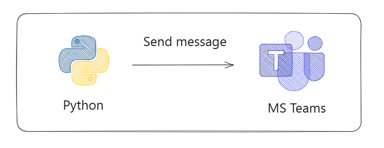
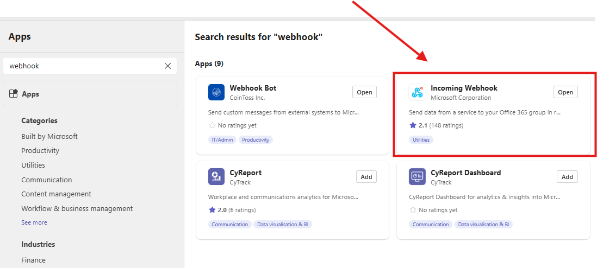
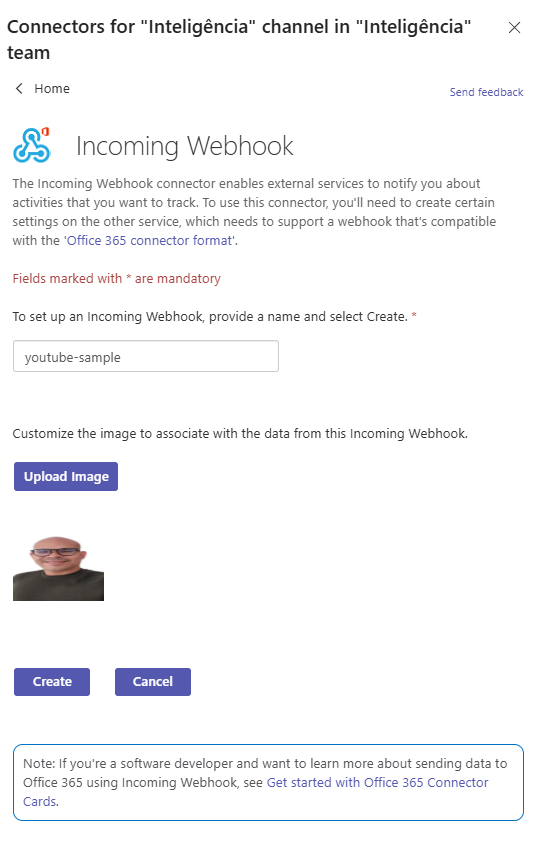
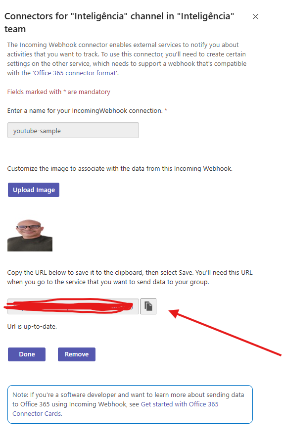
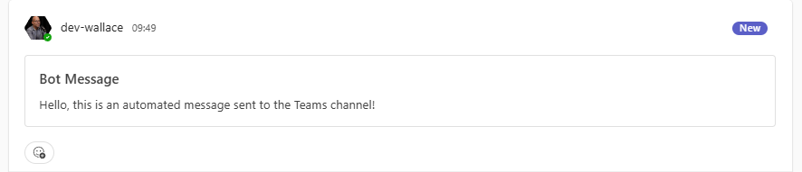
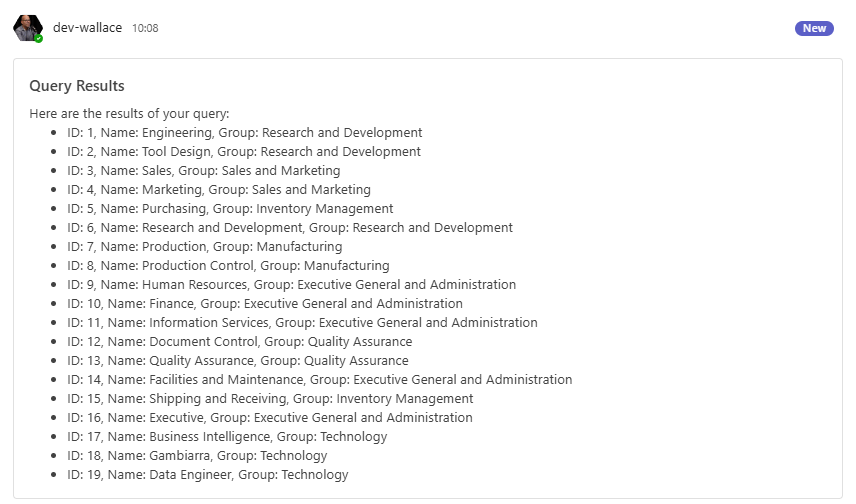
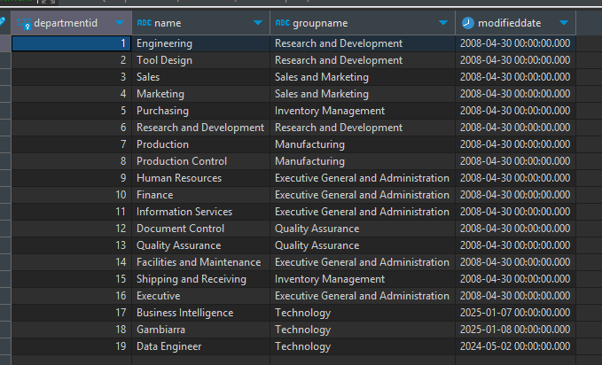

# Enviar mensagens para o Teams com Python
Esse repo tem o objetivo de mostrar como enviar mensagem para o Microsoft Teams com Python. 

## Arquitetura


## Video tutorial


## Pré-requisitos
- Configurar Webhook no Teams
- Python

## Como configurar webhook no Teams?
1 - Crie um canal


2 - Abra um incoming-webhook



3 - Adicione um nome para o Bot



4 - Copie o link gerado e cole no arquivo ```.env``` da pasta src


## Como utilizar o projeto?
Faça clone do projeto:
```
git clone www.github.com/wlcamargo/python-bot-teams
```
Entre na pasta:
```
cd python-bot-teams
```
Crie o ambiente virtual
```
python3 -m venv .venv
```
Ative o ambiente virtual (Linux): 
```
source .venv/bin/activate
```
Instale as libs:
```
pip install -r requirements.txt
```

## Como rodar o script?
Entre na pasta ```src``` e adicione o webhook do seu canal no Teams no arquivo ```.env```

Depois execute o programa com o comando:
```
python send_message.py
```

Resultado:


## Como Enviar resultado de uma query pelo Teams?

Nesse exemplo, vamos conectar no ```Postgres``` e enviar o resultado da query pelo Teams. 

Execute o programa:
```
python send_query.py
```

Resultado:


Tabela original no Postgres:


## Conclusão
Se você chegou até aqui, parabéns! Você já tem um bot integrado ao Microsfot Teams para automatizar o envio de mensagens críticas. 

## Referências

https://learn.microsoft.com/en-us/microsoftteams/platform/webhooks-and-connectors/how-to/add-incoming-webhook?tabs=newteams%2Cdotnet

## Developer
| Desenvolvedor      | LinkedIn                                   | Email                        | Portfólio                              |
|--------------------|--------------------------------------------|------------------------------|----------------------------------------|
| Wallace Camargo    | [LinkedIn](https://www.linkedin.com/in/wallace-camargo-35b615171/) | wallacecpdg@gmail.com        | [Portfólio](https://wlcamargo.github.io/)   |

